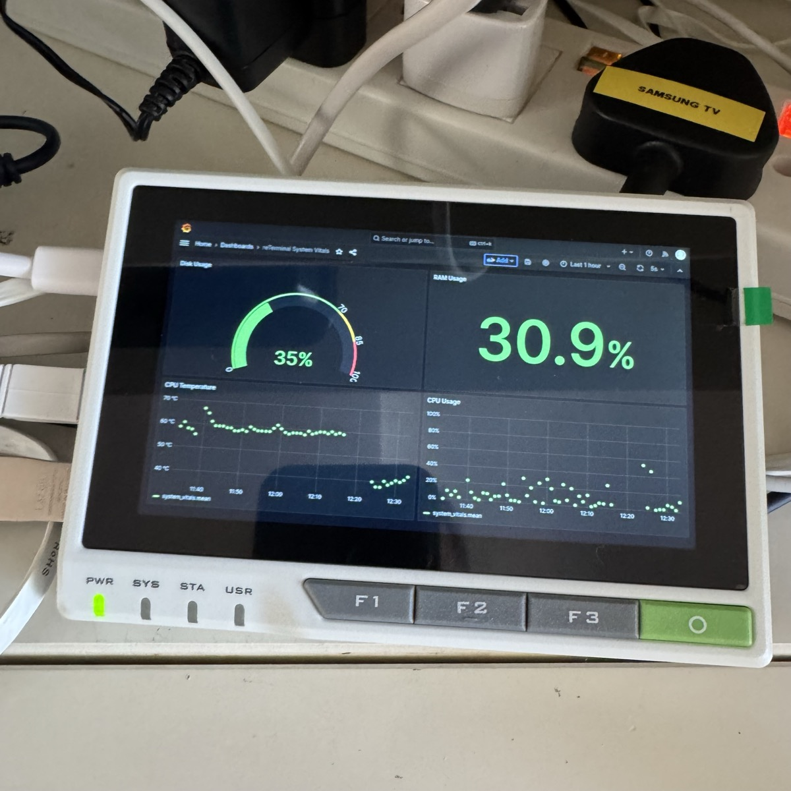

# Raspberry Pi Smart Home Project

[](https://opensource.org/licenses/MIT)
[](https://www.raspberrypi.com/)
[](https://www.docker.com/)
[](https://github.com/andygmassey/rpi-smart-home-project/releases)
[](https://github.com/andygmassey/rpi-smart-home-project)

A comprehensive smart home automation system running on Raspberry Pi CM4 with reTerminal display.

<p align="center">
  
</p>

> **🎯 Perfect for**: Home automation enthusiasts, Raspberry Pi tinkerers, and anyone wanting a self-hosted smart home hub with professional monitoring and network management.

## 🏠 Overview

This project provides a complete smart home solution featuring real-time monitoring, automation, network management, and hardware control - all running in a secure, containerized environment.

## 🌟 Why This Project?

- **🏡 Complete Solution**: Everything you need for home automation in one place
- **🔒 Privacy-First**: Self-hosted, no cloud dependencies
- **📊 Professional Monitoring**: Grafana dashboards rival enterprise solutions
- **🎮 Hardware Integration**: Custom GPIO button controls for the reTerminal
- **💾 Disaster Recovery**: Automated backup system with restore scripts
- **🛡️ Network Protection**: Built-in ad-blocking and DNS filtering
- **🔧 Production-Ready**: Watchdog systems, health checks, and auto-recovery

### ✨ Key Features

- **🏡 Home Automation**: Home Assistant with full supervisor support
- **📊 Real-time Monitoring**: Grafana + InfluxDB with custom dashboards  
- **🌐 Network Management**: Pi-hole DNS filtering and MQTT broker
- **📱 Unified Dashboard**: Homepage with service overview
- **⚡ Service Monitoring**: Uptime Kuma for availability tracking
- **🔧 Hardware Control**: Custom Python scripts for reTerminal
- **💾 Automated Backups**: Comprehensive backup and restore system
- **🛡️ System Health**: Automated monitoring with email alerts
- **🎮 Kiosk Mode**: Full-screen display modes for dashboards

## 🏗️ System Architecture

### Services Stack
```
┌─────────────────────────────────────────────────┐
│                 reTerminal Display               │
│        (Hardware Controls & Kiosk Mode)         │
├─────────────────────────────────────────────────┤
│              Homepage Dashboard                 │
│         (Unified Service Overview)              │
├─────────────────────────────────────────────────┤
│  Home Assistant  │  Grafana    │  Pi-hole      │
│  (Automation)    │ (Analytics) │  (DNS/AdBlock)│
├──────────────────┼─────────────┼───────────────┤
│   InfluxDB       │ Uptime Kuma │ MQTT Broker   │
│ (Time Series DB) │ (Monitoring)│ (IoT Messages)│
├─────────────────────────────────────────────────┤
│              Docker Container Layer             │
├─────────────────────────────────────────────────┤
│           Raspberry Pi OS (Debian)              │
└─────────────────────────────────────────────────┘
```

### Hardware
- **Platform**: Raspberry Pi CM4 with reTerminal
- **Storage**: eMMC (no SD card dependencies)
- **Display**: Built-in touchscreen with custom controls
- **Connectivity**: Ethernet, WiFi, GPIO access

## 📋 Services Overview

| Service | Purpose | Web Interface | Port |
|---------|---------|---------------|------|
| **Home Assistant** | Automation Hub | http://YOUR_DEVICE_IP:8123 | 8123 |
| **Grafana** | Data Visualization | http://YOUR_DEVICE_IP:3002 | 3002 |
| **InfluxDB** | Metrics Database | - | 8086 |
| **Pi-hole** | DNS + Ad Blocking | http://YOUR_DEVICE_IP/admin | 80 |
| **Homepage** | Unified Dashboard | http://YOUR_DEVICE_IP:3002 | 3002 |
| **Uptime Kuma** | Service Monitoring | http://YOUR_DEVICE_IP:3001 | 3001 |
| **MQTT Broker** | IoT Messaging | - | 1883 |
| **Fing Agent** | Network Discovery | - | - |

## 🚀 Quick Start

### Prerequisites
- Raspberry Pi CM4 with reTerminal
- Docker and Docker Compose installed
- Git configured

### Installation
```bash
# Clone repository
git clone https://github.com/andygmassey/rpi-smart-home-project.git
cd rpi-smart-home-project

# Setup environment
cp .env.example .env
nano .env  # Configure your passwords

# Deploy services
./scripts/system/deploy-all-services.sh

# Access main dashboard
open http://YOUR_DEVICE_IP:3002
```

## 📚 Documentation

### 📖 Complete Guides
- **[🔧 Installation Guide](docs/INSTALLATION.md)** - Complete setup instructions
- **[📖 Usage Guide](docs/USAGE.md)** - Daily operations and maintenance
- **[🛠️ Services Overview](docs/SERVICES.md)** - Detailed service documentation
- **[📋 Changelog](CHANGELOG.md)** - Version history and release notes
- **[🤝 Contributing](CONTRIBUTING.md)** - How to contribute to this project

### 🗂️ Quick References
- **[🔧 Script Reference](#script-reference)** - All automation scripts
- **[🐳 Docker Services](#docker-services)** - Container configurations
- **[💾 Backup System](#backup-system)** - Data protection
- **[⚡ Hardware Control](#hardware-control)** - reTerminal integration

## 🗂️ Directory Structure

```
📁 rpi-smart-home-project/
├── 📁 scripts/
│   ├── 📁 backup/          # Backup and restore automation
│   ├── 📁 monitoring/      # System health and metrics
│   ├── 📁 system/          # Service management utilities  
│   └── 📁 hardware/        # reTerminal hardware control
├── 📁 docker/              # Docker Compose configurations
│   ├── 📁 grafana-influx/  # Monitoring stack
│   ├── 📁 pihole/          # DNS and ad-blocking
│   ├── 📁 homepage/        # Unified dashboard
│   ├── 📁 uptime-kuma/     # Service monitoring
│   ├── 📁 mqtt-broker/     # IoT messaging
├── 📁 docs/                # Comprehensive documentation
├── 📄 .env.example         # Environment configuration template
└── 📄 .gitignore          # Security-focused exclusions
```

## 🔧 Script Reference

### 💾 Backup Scripts (`scripts/backup/`)
- **`backup-manager.sh`** - Interactive backup management
- **`create-app-backup.sh`** - Application data backup
- **`create-master-backup.sh`** - Golden master backup  
- **`create-system-backup.sh`** - Full system backup
- **`backup-to-external.sh`** - External drive backup

### 📊 Monitoring Scripts (`scripts/monitoring/`)
- **`rpi_vitals_monitor.sh`** - System metrics collection
- **`continuous_monitoring.sh`** - 24/7 health monitoring
- **`timezone_monitoring_script.sh`** - Timezone change tracking

### ⚙️ System Scripts (`scripts/system/`)
- **`manage-services.sh`** - Docker service management
- **`launch-ha-kiosk.sh`** - Home Assistant kiosk mode
- **`control-kiosk.sh`** - Display control utilities
- **`setup-vnc-remote.sh`** - Remote access setup

### 🔧 Hardware Scripts (`scripts/hardware/`)
- **`multi_button_handler.py`** - reTerminal button control

## 🛡️ Pi-hole Watchdog System

Pi-hole provides network-wide DNS and ad-blocking with a bulletproof 3-layer watchdog system:

### Coordinated Protection Layers
| Layer | Responsibility | Mechanism |
|-------|---------------|-----------|
| **Layer 1** | Container crashes | Docker restart policy |
| **Layer 2** | Service unhealthy | Smart watchdog script (every 2 min) |
| **Layer 3** | System boot | Systemd service |

### Features
- **Cooldown Protection**: 5-minute minimum between restarts, max 3/hour
- **Escalation**: Cleanup → Soft restart → Hard restart → Alert
- **Unlocator SmartDNS**: Upstream DNS for geo-unblocking streaming services
- **Database Capped**: 7-day retention prevents runaway growth

See `docs/WATCHDOG_SYSTEM.md` for full documentation.


## 🌐 VPN Routing Infrastructure

### Dual VPN Architecture

The system runs two concurrent OpenVPN tunnels for geographic traffic routing:

| Tunnel | Interface | Purpose | Provider |
|--------|-----------|---------|----------|
| Primary VPN | tun0 | Default traffic routing | Unlocator (US) |
| UK VPN | tun1 | Streaming geo-access | Unlocator (UK London) |

### Policy-Based Routing

Selective traffic routing is implemented using Linux policy routing (`ip rule` / `ip route`) rather than routing all traffic through the UK tunnel:

- **`route-nopull`**: UK VPN does not override default routes
- **Dedicated routing table** (`ukvpn`): Separate routing table for UK-bound traffic
- **Source-based routing**: Specific LAN devices are policy-routed through the UK tunnel via `ip rule`
- **NAT masquerade**: Traffic from routed devices is NATed on tun1 for proper return routing

### Systemd Services

| Service | Config | Description |
|---------|--------|-------------|
| `uk-vpn-prime.service` | `/etc/openvpn/client/uk-vpn.conf` | UK VPN tunnel + routing setup |

**Routing scripts:**
- `/usr/local/bin/setup-prime-routing.sh` — Creates routing table, ip rules, and NAT on VPN start
- `/usr/local/bin/cleanup-prime-routing.sh` — Removes routing rules on VPN stop

### Management
```bash
# Check status
sudo systemctl status uk-vpn-prime

# Restart UK VPN
sudo systemctl restart uk-vpn-prime

# Disable UK VPN
sudo systemctl disable --now uk-vpn-prime

# Verify routing
ip rule list
ip route show table ukvpn
```


## 🐳 Docker Services

All services run in isolated Docker containers with persistent data storage:

### Core Stack
```bash
# Start monitoring stack
cd docker/grafana-influx && docker-compose up -d

# Start network services  
cd ../pihole && docker-compose up -d
cd ../mqtt-broker && docker-compose up -d

# Start dashboards
cd ../homepage && docker-compose up -d
cd ../uptime-kuma && docker-compose up -d
```

### Service Health
```bash
# Check all services
docker ps --format "table {{.Names}}\t{{.Status}}\t{{.Ports}}"

# Monitor resources
docker stats --no-stream
```

## 💾 Backup System

### Automated Backups
- **System Health Monitoring**: Every 6 hours with email alerts
- **Vitals Collection**: Every minute to InfluxDB
- **Application Backup**: Weekly automated backup
- **Configuration Backup**: Continuous Git versioning

### Manual Backup
```bash
# Quick application backup
./scripts/backup/create-app-backup.sh

# Full system backup
./scripts/backup/create-master-backup.sh

# Interactive backup manager
./scripts/backup/backup-manager.sh
```

### Restore Operations
```bash
# List available backups
ls ~/backups/

# Restore from backup
./scripts/backup/backup-manager.sh restore
```

## ⚡ Hardware Control

### reTerminal Integration
```bash
# Start button handler
python3 scripts/hardware/multi_button_handler.py

# Launch kiosk mode
./scripts/system/launch-ha-kiosk.sh

# Control display
./scripts/system/control-kiosk.sh [start|stop|restart]
```

### Hardware Features
- **Multi-button Control**: Custom actions for hardware buttons
- **Display Management**: Automatic brightness and power control
- **GPIO Integration**: Full access to Raspberry Pi GPIO
- **Touch Interface**: Direct touchscreen interaction

## 🛡️ Security Features

### Data Protection
- **🔐 Environment Variables**: No hardcoded passwords
- **🗂️ Comprehensive .gitignore**: Sensitive files excluded
- **🔒 Private Repository**: Code safely stored
- **🛡️ Container Isolation**: Services run in isolated containers

### Network Security
- **🌐 Pi-hole DNS Filtering**: Network-wide ad and malware blocking
- **🔒 Local Network Only**: No external dependencies required
- **📊 Traffic Monitoring**: Full network visibility

### System Monitoring
- **📊 Real-time Metrics**: System health dashboards
- **📧 Email Alerts**: Automated problem notifications  
- **📈 Historical Data**: Long-term performance tracking

## 📊 Monitoring & Alerts

### System Health Monitoring
The system automatically monitors:
- **Memory Usage**: Alerts at >90%
- **Swap Usage**: Alerts at >50% 
- **CPU Temperature**: Alerts at >80°C
- **Load Average**: Alerts at >8.0
- **Service Status**: Container health checks
- **Disk Space**: Storage monitoring

### Alert Destinations
- **Email Notifications**: Configurable SMTP alerts
- **Dashboard Alerts**: Grafana alert rules
- **Service Monitoring**: Uptime Kuma notifications

## 🔄 Development & Maintenance

### Version Control
```bash
# Make changes
git add .
git commit -m "Update configuration"
git push

# Create feature branch
git checkout -b new-feature
```

### Maintenance Tasks
```bash
# System updates
sudo apt update && sudo apt upgrade -y

# Docker cleanup
docker system prune -f

# Service restart
./scripts/system/manage-services.sh restart
```

## 🆘 Support & Troubleshooting

### Common Commands
```bash
# Check system health
./scripts/monitoring/system-health-check.sh

# View service logs
docker logs <service-name>

# Restart all services
./scripts/system/manage-services.sh restart

# Emergency backup
./scripts/backup/create-app-backup.sh
```

### Documentation
- **[📖 Full Installation Guide](docs/INSTALLATION.md)**
- **[📚 Complete Usage Guide](docs/USAGE.md)**  
- **[🛠️ Service Details](docs/SERVICES.md)**

### Getting Help
1. Check service logs: `docker logs <service>`
2. Run system health check: `./scripts/monitoring/system-health-check.sh`
3. Review documentation in `docs/` directory
4. Check GitHub issues for known problems

## 🏆 Project Status

**✅ Production Ready**
- All services deployed and monitored
- Comprehensive backup system active
- Full documentation complete
- Security hardening implemented
- Hardware integration functional


## 🎯 Use Cases

This project is ideal for:

- **🏠 Home Automation Enthusiasts**: Complete control over your smart home
- **🔐 Privacy-Conscious Users**: Keep your data on your own hardware
- **📊 Data Nerds**: Beautiful real-time dashboards for system monitoring
- **🎓 Learning Projects**: Great for understanding Docker, networking, and automation
- **🏢 Home Lab**: Professional-grade monitoring for your home network
- **🌐 Network Administrators**: Family network management with ad-blocking and DNS control

## 🗺️ Roadmap

Future enhancements being considered:

- [ ] Zigbee/Z-Wave device integration examples
- [ ] Energy monitoring dashboards
- [ ] Automated offsite backup to cloud storage
- [ ] Mobile app companion
- [ ] Voice assistant integration (Alexa/Google Home)
- [ ] Advanced automation examples
- [ ] Kubernetes deployment option
- [ ] Multi-device support documentation

**Have an idea?** Open an issue or discussion to suggest new features!

## 🤝 Contributing

Contributions are welcome! Please see [CONTRIBUTING.md](CONTRIBUTING.md) for guidelines.

<!-- ALL-CONTRIBUTORS-LIST:START -->
Thanks to everyone who has contributed to this project!
<!-- ALL-CONTRIBUTORS-LIST:END -->

## 📄 License

This project is licensed under the MIT License - see the [LICENSE](LICENSE) file for details.

Third-party Docker images and services retain their respective licenses. See [LICENSE](LICENSE) for full details.

## 🙏 Acknowledgments

- **[Pi-hole](https://pi-hole.net/)** - Network-wide ad blocking
- **[Home Assistant](https://www.home-assistant.io/)** - Open source home automation
- **[Grafana](https://grafana.com/)** - Beautiful monitoring dashboards
- **[SeeedStudio](https://www.seeedstudio.com/)** - reTerminal hardware platform
- **Raspberry Pi Foundation** - Amazing single-board computers

## 💬 Community & Support

- **🐛 Bug Reports**: [GitHub Issues](https://github.com/andygmassey/rpi-smart-home-project/issues)
- **💡 Feature Requests**: [GitHub Discussions](https://github.com/andygmassey/rpi-smart-home-project/discussions)
- **❓ Questions**: [GitHub Discussions Q&A](https://github.com/andygmassey/rpi-smart-home-project/discussions/categories/q-a)
- **📢 Announcements**: [GitHub Discussions](https://github.com/andygmassey/rpi-smart-home-project/discussions/categories/announcements)

---

<div align="center">

**[⬆ Back to Top](#raspberry-pi-smart-home-project)**

Made with ❤️ for the home automation community

**[⭐ Star this repo](https://github.com/andygmassey/rpi-smart-home-project)** if you find it useful!

</div>
