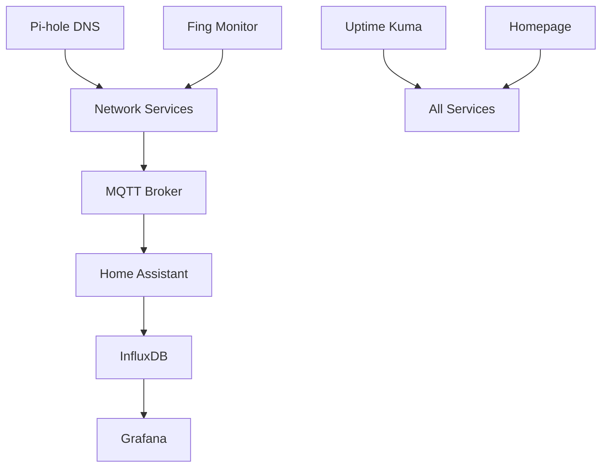

# Smart Home Services Overview

This document describes all the Docker services running in the smart home system.

## Core Services

### 🏠 Home Assistant (`homeassistant`)
- **Image**: `ghcr.io/home-assistant/raspberrypi4-homeassistant:2025.8.2`
- **Port**: 8123 (web interface)
- **Purpose**: Central home automation platform
- **Configuration**: Managed by Home Assistant Supervisor
- **Access**: http://localhost:8123

### 📊 Monitoring Stack

#### Grafana (`grafana`)
- **Image**: `grafana/grafana:9.5.15`
- **Port**: 3000
- **Purpose**: Data visualization and dashboards
- **Config**: `docker/grafana-influx/`
- **Access**: http://localhost:3000

#### InfluxDB (`influxdb`)
- **Image**: `influxdb:1.8`
- **Port**: 8086
- **Purpose**: Time-series database for metrics
- **Database**: `smarthome`
- **Config**: `docker/grafana-influx/`

### 🌐 Network Services

#### Pi-hole DNS (`pihole`)
- **Image**: `pihole/pihole:latest`
- **Ports**: 53 (DNS), 80 (admin)
- **Purpose**: Network-wide ad blocking and DNS
- **Config**: `docker/pihole/`
- **Access**: http://localhost/admin
- **Upstream DNS**: Unlocator SmartDNS (185.37.37.37, 185.37.39.39)

#### Pi-hole Webhook (`pihole-webhook`)
- **Port**: 8888
- **Purpose**: Temporarily pause Pi-hole blocking via HTTP request
- **Config**: `scripts/system/pihole-webhook.py`
- **Service**: `system/systemd/pihole-webhook.service`
- **Usage**: `http://192.168.1.76:8888/?duration=10`
- **Safari Bookmark**: Add the URL above to quickly pause blocking for 10 seconds when visiting a link that Pi-hole is blocking too aggressively

#### Uptime Kuma (`uptime-kuma`)
- **Image**: `louislam/uptime-kuma:latest`
- **Port**: 3001
- **Purpose**: Service monitoring and uptime tracking
- **Config**: `docker/uptime-kuma/`
- **Access**: http://localhost:3001

#### MQTT Broker (`mosquitto`)
- **Image**: `eclipse-mosquitto:latest`
- **Port**: 1883
- **Purpose**: IoT messaging protocol broker
- **Config**: `docker/mqtt-broker/`

### 📱 Dashboard & Monitoring

#### Homepage Dashboard (`homepage`)
- **Image**: `ghcr.io/gethomepage/homepage:v0.8.8`
- **Port**: 3000
- **Purpose**: Unified dashboard for all services
- **Config**: `docker/homepage/config/`
- **Access**: http://localhost:3000

#### Fing Network Monitor (`network-monitor`)
- **Image**: `fing-agent-docker-network-monitor`
- **Purpose**: Network device discovery and monitoring
- **Config**: `docker/fing-agent-network/`

## Home Assistant Supervisor Services

These are managed automatically by Home Assistant:

- **hassio_supervisor**: Core supervisor service
- **hassio_observer**: System monitoring
- **hassio_dns**: Internal DNS resolution
- **hassio_audio**: Audio system integration
- **hassio_cli**: Command line interface
- **hassio_multicast**: Network multicast support

## Service Dependencies

## Data Flow

1. **IoT Devices** → **MQTT Broker** → **Home Assistant**
2. **Home Assistant** → **InfluxDB** (metrics storage)
3. **System Metrics Script** → **InfluxDB**
4. **InfluxDB** → **Grafana** (visualization)
5. **All Services** ← **Uptime Kuma** (monitoring)
6. **All Services** ← **Homepage** (dashboard)

## Storage Locations

- **Home Assistant Config**: `/usr/share/hassio/homeassistant/`
- **InfluxDB Data**: `docker/grafana-influx/influxdb-data/`
- **Grafana Data**: `docker/grafana-influx/grafana-data/`
- **Pi-hole Config**: `docker/pihole/etc-pihole/`
- **Uptime Kuma Data**: `docker/uptime-kuma/data/`
- **MQTT Config**: `docker/mqtt-broker/config/`

## Security Notes

- All services run in Docker containers for isolation
- Sensitive passwords stored in environment variables
- Pi-hole provides network-level security
- Regular automated backups via custom scripts
